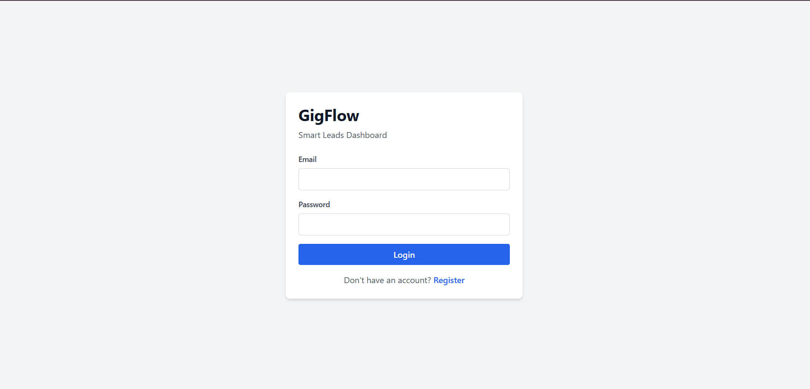
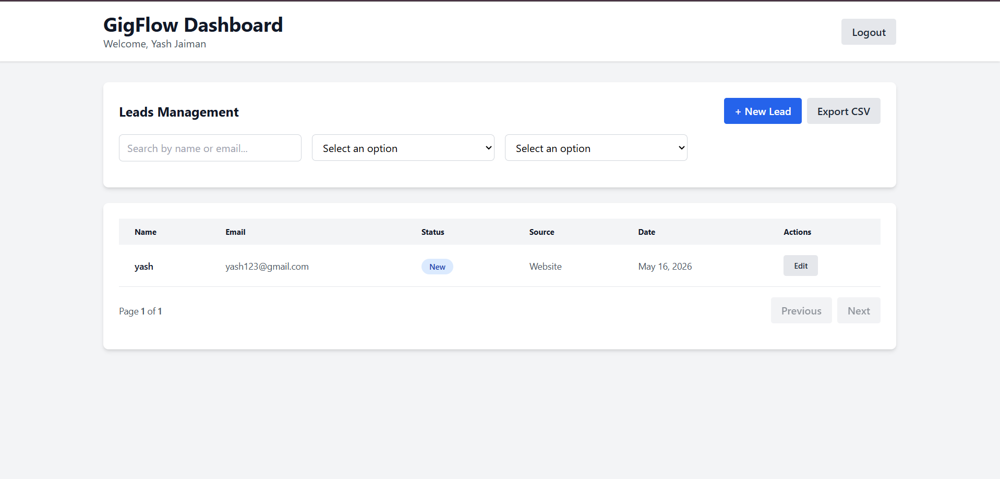
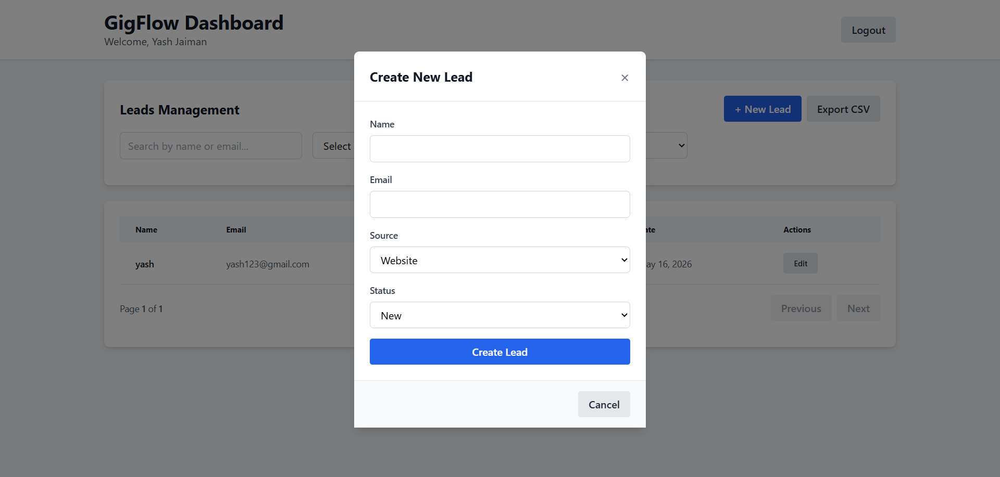

# 🚀 GigFlow — Smart Leads Dashboard


## GigFlow
**A modern full-stack leads management dashboard** built for growth-focused sales teams. GigFlow combines secure authentication, intuitive lead workflows, and production-ready architecture in one polished solution.

---

## 🚀 Project Summary

GigFlow is a production-ready MERN-style application featuring:

- Type-safe frontend and backend with TypeScript
- Secure JWT authentication with role-based access control
- Lead CRUD, filtering, pagination, and export
- Responsive Tailwind UI for desktop and mobile
- Docker Compose support for local development

---

## 🌐 Live Demo

> Placeholder: add your hosted URL here after deployment.

---

## 📸 Screenshots

### Login Page


_A clean authentication experience with sign-in validation and role-aware navigation._

### Dashboard


_Overview of active leads, filters, and quick status visualizations in the main dashboard._

### Lead Management


_Lead creation, editing, and export workflows designed for efficient sales operations._

---

## ✨ Features Overview

| Feature | Description |
| --- | --- |
| Authentication | JWT-based login/register with admin/sales permissions |
| Lead Management | Create, view, update, and delete leads with a clear workflow |
| Filtering | Search, status, source, and sort filtering |
| Pagination | Fast server-side pagination for large datasets |
| CSV Export | Export filtered leads to CSV format |
| Responsive UI | TailwindCSS layout for all screen sizes |
| Type Safety | Shared TypeScript interfaces across frontend/backend |
| Docker Support | Containerized local development via Docker Compose |

---

## 🏗️ Architecture

GigFlow is designed as a two-tier full-stack application with a clean separation of responsibilities.

### Frontend

- Built with **React + Vite**
- State managed by **Zustand**
- API calls handled with **Axios**
- Route protection implemented with **React Router**
- UI styled using **TailwindCSS**

### Backend

- Built with **Node.js + Express**
- Uses **MongoDB** with **Mongoose** schemas
- Authentication via **JWT tokens**
- Input validation via **express-validator**
- Centralized error handling and middleware

### Deployment

- Local development supported via **Docker Compose**
- Production-ready deployment strategy for **Vercel** (frontend) and **Render** (backend)
- Supports MongoDB Atlas for managed database deployment

---

## 📁 Folder Structure

### Frontend (`client/`)

- `public/` — static assets
- `src/components/` — reusable UI components
- `src/pages/` — route-level pages
- `src/layouts/` — app layout components
- `src/hooks/` — custom hooks
- `src/services/` — API communication helpers
- `src/store/` — Zustand state stores
- `src/types/` — shared TypeScript types
- `src/utils/` — helper utilities
- `src/App.tsx` — root application component
- `src/main.tsx` — Vite entry point

### Backend (`server/`)

- `src/config/` — environment and database configuration
- `src/controllers/` — API request handlers
- `src/middleware/` — authentication, validation, errors
- `src/models/` — MongoDB schemas and models
- `src/routes/` — route definitions
- `src/services/` — business logic utilities
- `src/types/` — backend TypeScript interfaces
- `src/validators/` — request validation logic
- `src/utils/` — helper functions
- `src/index.ts` — server bootstrap

---

## ⚙️ Tech Stack

### Frontend
- React 18
- TypeScript
- Vite
- TailwindCSS
- Zustand
- Axios
- React Router

### Backend
- Node.js 18+
- Express
- TypeScript
- MongoDB
- Mongoose
- JWT
- bcryptjs
- express-validator

### DevOps
- Docker
- Docker Compose
- MongoDB Atlas
- Vercel / Render

---

## 🚀 Getting Started

### Prerequisites

- Node.js 18+
- npm 10+ or yarn
- MongoDB (local or Atlas)
- Docker and Docker Compose (optional)

### Windows Setup

```powershell
cd server
copy .env.example .env
npm install
npm run dev
```

```powershell
cd client
copy .env.example .env
npm install
npm run dev
```

### macOS / Linux Setup

```bash
cd server
cp .env.example .env
npm install
npm run dev
```

```bash
cd client
cp .env.example .env
npm install
npm run dev
```

Frontend: `http://localhost:5173`
Backend: `http://localhost:5000`

### Docker Setup

```bash
docker-compose up -d
docker-compose logs -f
docker-compose down
```

---

## 🔐 Environment Variables

### Backend (`server/.env`)

```env
PORT=5000
NODE_ENV=development
MONGODB_URI=mongodb://localhost:27017/gigflow
JWT_SECRET=your_super_secret_jwt_key_change_in_production
JWT_EXPIRE=7d
BCRYPT_ROUNDS=10
CORS_ORIGIN=http://localhost:5173
```

### Frontend (`client/.env`)

```env
VITE_API_URL=http://localhost:5000/api
```

---

## 📚 API Documentation

### Authentication

#### Register
```http
POST /api/auth/register
Content-Type: application/json

{
  "name": "John Doe",
  "email": "john@example.com",
  "password": "securepassword",
  "role": "sales"
}
```

#### Login
```http
POST /api/auth/login
Content-Type: application/json

{
  "email": "john@example.com",
  "password": "securepassword"
}
```

#### Get Current User
```http
GET /api/auth/me
Authorization: Bearer <token>
```

### Lead Management

#### Get Leads
```http
GET /api/leads?page=1&limit=10&status=New&source=Website&search=john&sortBy=-createdAt
Authorization: Bearer <token>
```

#### Get Lead
```http
GET /api/leads/:id
Authorization: Bearer <token>
```

#### Create Lead
```http
POST /api/leads
Authorization: Bearer <token>
Content-Type: application/json

{
  "name": "Jane Doe",
  "email": "jane@example.com",
  "source": "Website",
  "status": "New"
}
```

#### Update Lead
```http
PUT /api/leads/:id
Authorization: Bearer <token>
Content-Type: application/json

{
  "status": "Contacted",
  "name": "Jane Smith"
}
```

#### Delete Lead
```http
DELETE /api/leads/:id
Authorization: Bearer <token>
```

---

## 👥 User Roles

### Admin
- Full access to all leads
- Delete any lead
- View all users' leads

### Sales
- Create and update leads
- View own leads
- Cannot delete leads

---

## 🧪 Production Build

### Backend

```bash
cd server
npm run build
npm start
```

### Frontend

```bash
cd client
npm run build
npm run preview
```

---

## ☁️ Deployment

### Backend on Render
1. Push repository to GitHub
2. Create a Render service
3. Set build command: `npm run build`
4. Set start command: `npm start`
5. Add backend environment variables

### Frontend on Vercel
1. Connect repo to Vercel
2. Set build command: `npm run build`
3. Set output directory: `dist`
4. Add `VITE_API_URL` env var

### MongoDB Atlas
1. Create a cluster
2. Copy the connection string
3. Update `MONGODB_URI` in backend `.env`

---

## ❗ Common Issues & Fixes

### 1. Dev server fails on Windows
- Ensure Node.js 18+ is installed
- Run PowerShell as administrator
- Run `npm install` in both `server/` and `client/`

### 2. Environment variables not loading
- Copy `.env.example` to `.env`
- Restart the terminal after editing `.env`
- Verify `VITE_API_URL` is correct

### 3. MongoDB connection issues
- Confirm local MongoDB is running
- Or use Atlas connection string
- Check network/firewall settings

### 4. CORS or auth token problems
- Ensure `CORS_ORIGIN=http://localhost:5173`
- Confirm frontend sends valid JWT token

---

## 🌱 Future Improvements

- Role-specific admin and sales dashboards
- Real-time updates with WebSockets
- Full unit and integration test coverage
- Enhanced accessibility and keyboard navigation
- Multi-tenant support and team collaboration
- Analytics and reporting dashboards

---

## 🤝 Contributing

Contributions are welcome!

1. Fork the repository
2. Create a new branch: `git checkout -b feature/your-feature`
3. Install dependencies and test locally
4. Open a pull request with a clear summary

### Guidelines
- Keep PRs small and focused
- Follow existing TypeScript conventions
- Add documentation for new features
- Validate changes before submitting

---

## 👨‍💻 Author

**Yash Jaiman**

Built with care for modern sales workflows and developer experience.

---

